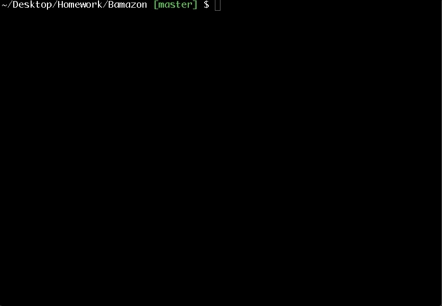

# Bamazon

Bamazon is an app that takes in orders from customers and deplete  stock from the store's inventory. 

## Chalenge 1: Customer View

The table lists:
* an id for each product
* the product name
* the department name
* the price 
* the stock quantity

This app prompts users with two messages:
* ask to enter the ID of the product they would like to buy
* ask how many units of the product they would like to buy

Once the customer has placed the order, the app responses either "successful purchase" or, if the store hasn't enough product " Insufficient quantity!"

## Chalenge 2: Manager View
