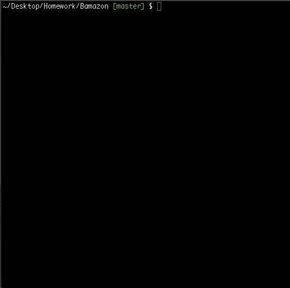

# Bamazon

Bamazon is an app that takes in orders from customers and deplete stock from the store's inventory. 

## Chalenge 1: Customer View

The table lists:
* an id for each product
* the product name
* the department name
* the price 
* the stock quantity

This app prompts customers with two messages :
* `Enter the ID of the product they would like to buy`
* `How many units of the product they would like to buy?`

Once the customer has placed the order, the app responses either `successful purchase` if the stock quantity is sufficient or `Insufficient quantity!` if the stock quantity of the product resquested is insufficient.

## Chalenge 2: Manager View

This app prompts manager with one question:
* `What would you like to do?`

The manager has 6 choices:
1. `View Products for sale` which displays all the store's inventory of products for sale
2. `View Low Inventory` which displays the store's inventory whose the quantity of products is less than 5
3. `Add to Inventory` which allows the manager to extend the stock quantity of one product

4. `Add new product` which allows the manager to add a new product in the strore's inventory

5. `Quit` to quit the app

